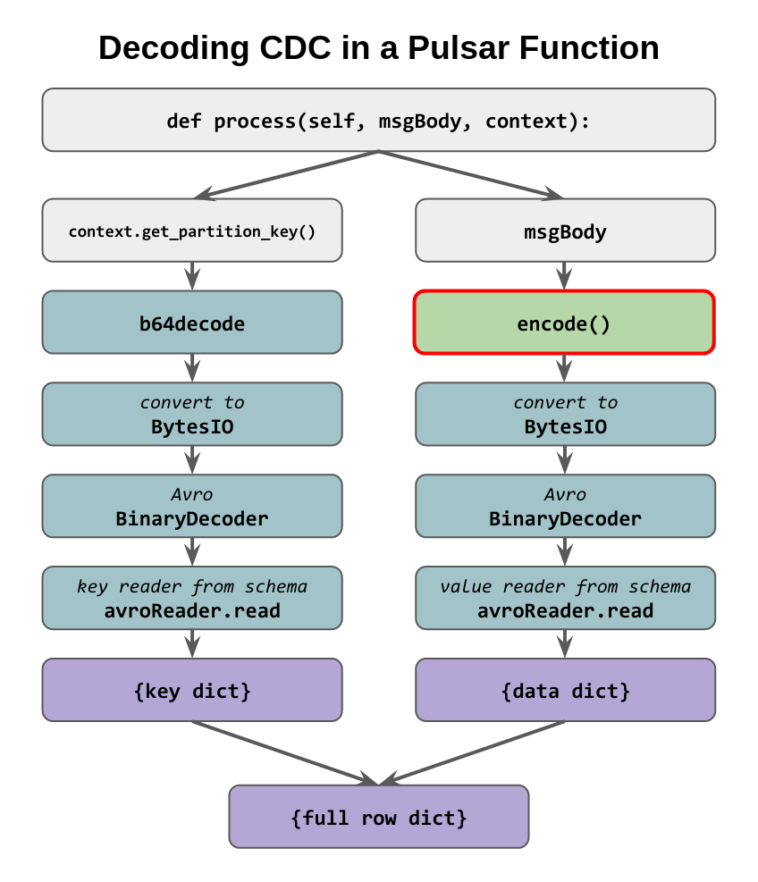

# Problem statement

> We have CDC enabled from an Astra DB table
> to an Astra Streaming topic and we want to decode the content
> of each event to have it e.g. as a plain JSON.
> **In a Pulsar function**.

### Read more

For more info and context, head over to [this repo](https://github.com/hemidactylus/decoding-cdc-astra-streaming-functions#readme).

### Setup

Skipping the obvious, the table you should create to match the example has shape:

```
CREATE TABLE track3demo.reviews (
    hotel TEXT,
    id TIMEUUID,
    reviewer TEXT,
    body TEXT,
    is_valid BOOLEAN,
    score INT,
    PRIMARY KEY ( (hotel), id )
  ) WITH CLUSTERING ORDER BY ( id DESC );
```

### Packaging

The Pulsar function in this case re-routes a JSON string with the whole CDC row onto another, schemaless topic.

To package it as ZIP one has to include the wheel for Avro. More details about the packaging operation in [the source repo](https://github.com/hemidactylus/decoding-cdc-astra-streaming-functions#readme).

### Decoding the CDC

The code illustrates what goes on. Alternatively:



*Beware*, the message body arrives in either bytes or string form and
care must be taken for its further processing (check the code and the flow diagram above).
